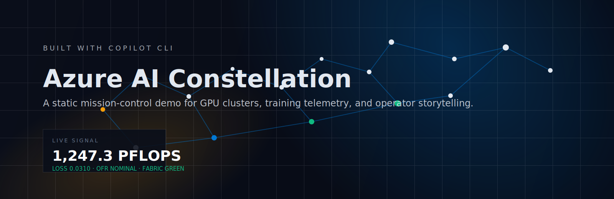
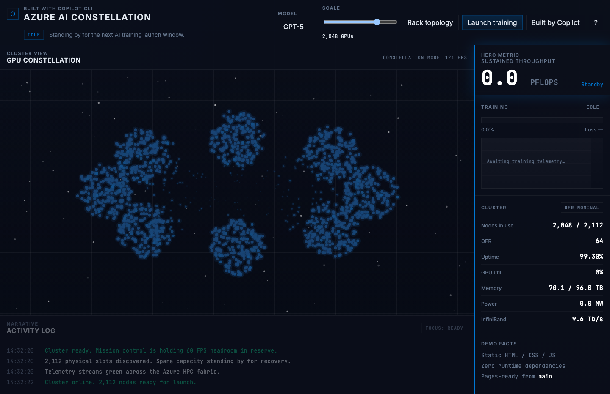
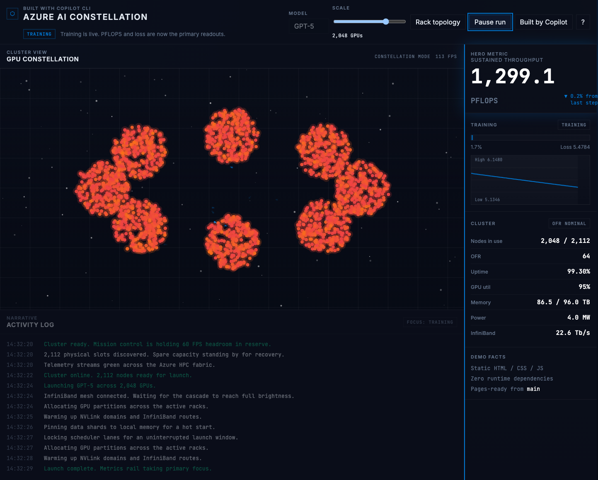
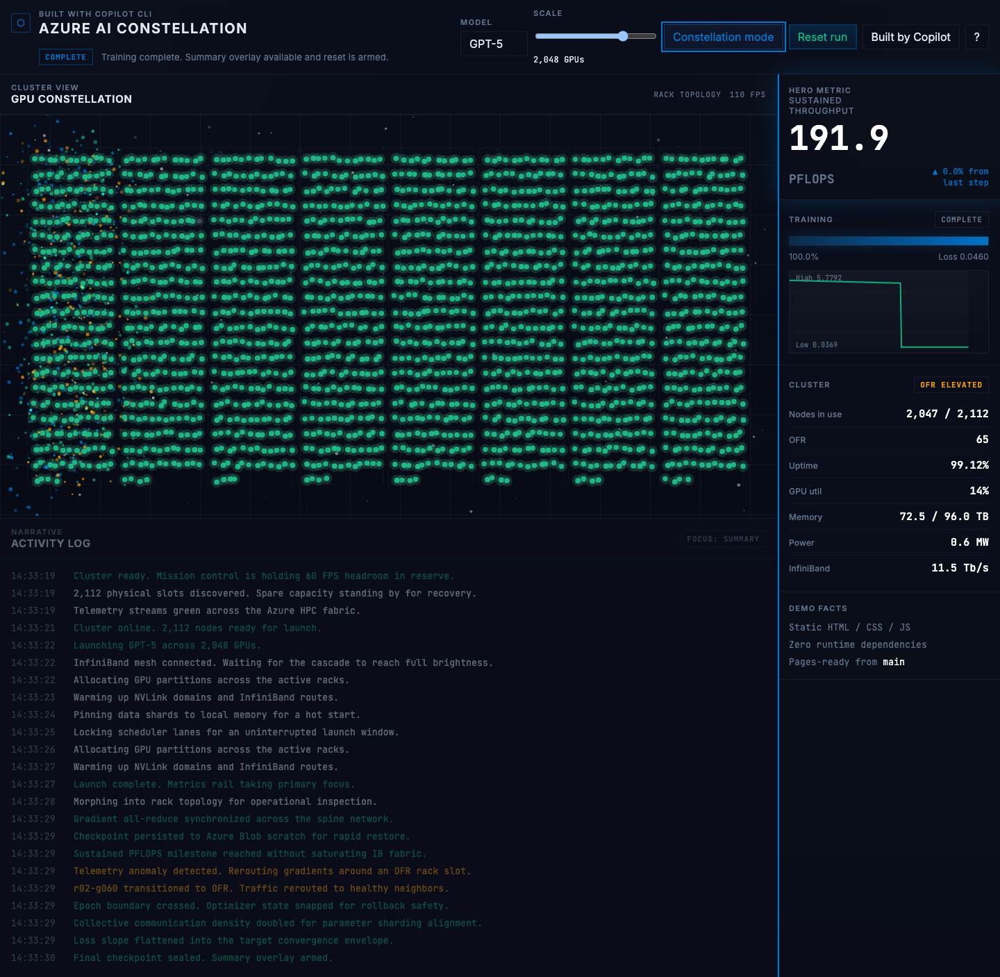

# Azure AI Constellation

[Live demo](https://ridermw.github.io/copilot-app/) · [Plan](./PLAN.md)



**Azure AI Constellation** is a screen-share-ready static demo built to show what GitHub Copilot CLI can deliver quickly: animated cluster graphics, simulated Azure HPC telemetry, topology morphing, failure recovery, and a polished operator-style UI with no runtime dependencies.

<p align="center">
  
  
  
</p>

## Demo highlights

- **Mission-control aesthetic** tuned for Azure HPC conversations instead of generic AI glassmorphism
- **Constellation ↔ rack topology morph** for both storytelling and operational inspection
- **Simulated PFLOPS, loss, OFR, uptime, power, and InfiniBand** metrics tied to the run state
- **Click-to-inspect GPU nodes**, scripted milestones, and automatic failure / recovery choreography
- **Static deploy** that runs locally or on GitHub Pages with the same files

## Local run

```bash
npm start
```

Or open it directly:

```bash
python3 -m http.server 4173
open http://127.0.0.1:4173
```

The app is designed for desktop presentation and intentionally warns below **1280px** width.

## Presentation talk track

1. Let the intro animation land, then point out that the whole thing is static HTML, CSS, and JavaScript.
2. Launch training and narrate the activation cascade, PFLOPS ramp, and loss curve.
3. Toggle into **Rack topology** to pivot from “story view” to “operator view.”
4. Click a node to inspect GPU health, utilization, and rack placement.
5. Scale the cluster live to show the simulation and visuals adapt without a reload.
6. Finish on the summary overlay and the “Built by Copilot” panel.

## Controls

| Control | Action |
| --- | --- |
| Launch training | Start, pause, resume, or reset the run |
| Model selector | Swap between GPT-5, Phi-4, and DALL-E 4 presets when idle |
| Scale slider | Snap between 256, 512, 1024, 2048, and 4096 GPUs |
| Rack topology | Morph between storytelling and operator layouts |
| `Space` / `+` / `-` / `V` / `C` / `R` / `?` | Keyboard shortcuts for live demos |

## Deployment

Pushes to `main` trigger **GitHub Pages** deployment through `.github/workflows/pages.yml`. The repo is configured for workflow-based Pages publishing, so no separate build step is required.

## Validation

- Browser smoke-tested through the full flow: **boot → launch → training → rack view → node inspect → summary**
- No console errors during the scripted UI pass
- Screenshots in this README were generated from the live app during the Playwright smoke run

## Project shape

```text
index.html
style.css
js/config.js
js/constellation.js
js/particles.js
js/dashboard.js
js/activity-log.js
js/app.js
```
